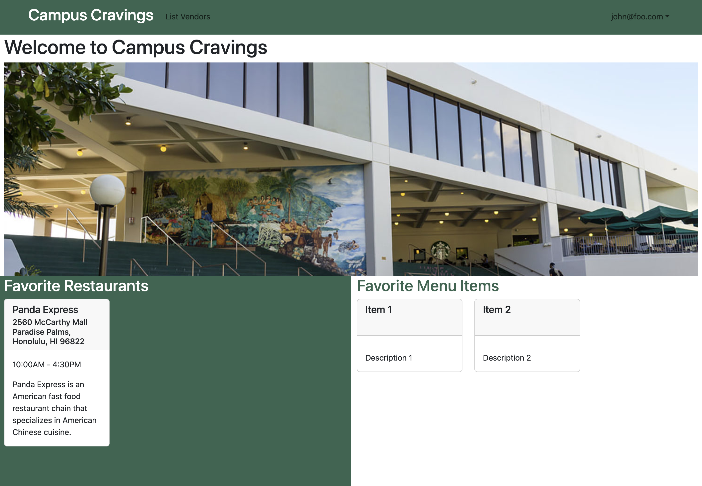
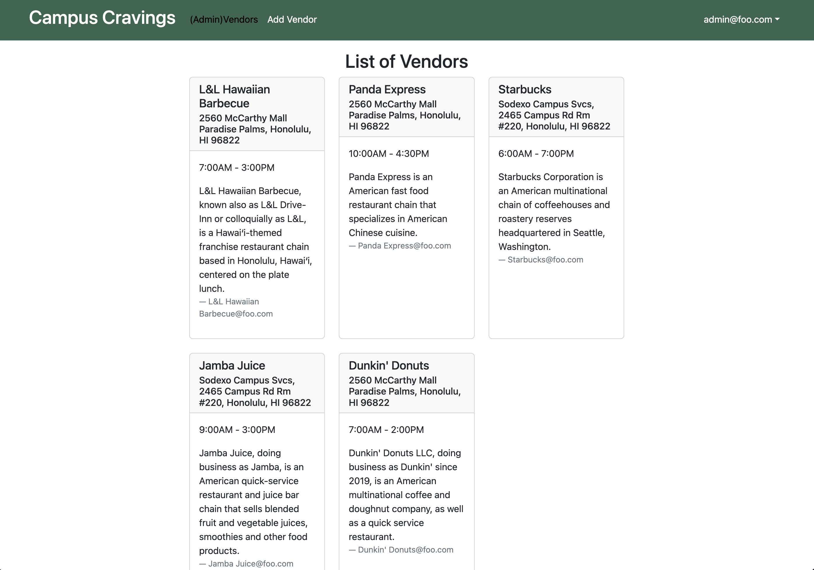

# Campus Cravings

## Table of contents

* [Overview](#overview)
* [Deployment](#deployment)
* [User Guide](#user-guide)
* [Developer Guide](#developer-guide)
* [Continuous Integration](#continuous-integration)
* [Development History](#development-history)
* [Example Enhancements](#example-enhancements)
* [Community Feedback](#community-feedback)
* [Team](#team)

## Overview

Campus Cravings is a database of restaurants on and near the campus of UH Manoa which will include the names, location, menus, prices, hours of operation, and payment methods of each.  This database will significantly benefit UH Manoa students by providing a convenient and easily accessible resource for all things related to on-campus dining.  Including accounts for eatery owners will help maintain up-to-date and accurate restaurant information, enhancing the overall dining experience on campus.

## Deployment
[Campus Cravings hosted on Digital Ocean](https://campus-cravings.site/)

## User Guide

This section provides a walkthrough of the Campus Cravings user interface and its capabilities.

### Landing Page

The landing page is presented to users when they visit the top-level URL to the site.


### Home Pages (User, Vendor, Admin)

Campus Cravings provides three separate home pages that present the contents of the database organized in various ways.

The user home page allows regular users to view the various restaurants and menus and select their favorites.


The vendor home page allows the users affiliated to specific restaurants to add/edit menu items and adjust the prices. These users will still be able to utilize the same functions that the regular user has access to.


Finally, the admin home page allows the admin to add/edit restaurants and verify restaurant admin accounts. Admin users will be able to utilize all functions that Campus Cravings provides.


### Sign in and sign up

Click on the "Login" button in the upper right corner of the navbar, then select "Sign in" to go to the following page and login. You must have been previously registered with the system to use this option:


Alternatively, you can select "Sign up" to go to the following page and register as a new user:


Signing up as a new user requires them to first set up their profile with their preferences in food. Specifically, what types of food to include or exclude based on factors such as ethnicity of the food, or vegan friendly. 

### Profile Page


Page displays profile information.  Will later have favorite resturaunt and Menu item features.

### User Profile


After clicking on a profile icon/button, you will be taken to the user profile page. This page is where users can change their preferences, or where vendors can change their choices for the day or otherwise modify their profile.

### Add Vendor page

Admin users can define new vendors with the Add Vendor page:


### List Restaurant page

All users can view all of the restaurants in the system with the List Restaurant page:


### Add Menu Item page

Vendors can define new menu items within their restaurant with the Add Menu Item page.  Vendor field is now automatically set to the vendor's account username:


### Menu Item page

All users are able to view the Menus of different resturaunts:


Vendors are now able to remove menu items from their own Menu page:


## Developer Guide

This section provides information of interest to Meteor developers wishing to use this code base as a basis for their own development tasks.

### Installation

First, [install Meteor](https://www.meteor.com/install).

Second, visit the [Campus Cravings application github page](https://github.com/campuscravings/campus-cravings), and click the "Use this template" button to create your own repository initialized with a copy of this application. Alternatively, you can download the sources as a zip file or make a fork of the repo.  However you do it, download a copy of the repo to your local computer.

Third, cd into the campus-cravings/app directory and install libraries with:

```
$ meteor npm install
```

Fourth, run the system with:

```
$ meteor npm run start
```

If all goes well, the application will appear at [http://localhost:3000](http://localhost:3000).

## Continuous Integration

[]

Campus Cravings uses [GitHub Actions](https://docs.github.com/en/free-pro-team@latest/actions) to automatically run ESLint and TestCafe each time a commit is made to the default branch.  You can see the results of all recent "workflows" at [https://github.com/campuscravings/campus-cravings/actions](https://github.com/campuscravings/campus-cravings/actions).

The workflow definition file is quite simple and is located at
[.github/workflows/ci.yml](https://github.com/campuscravings/campus-cravings/blob/main/.github/workflows/ci.yml).

## Development History

The development process for Campus Cravings conformed to [Issue Driven Project Management](https://courses.ics.hawaii.edu/ics314f23/modules/project-management/) practices. In a nutshell:

* Development consists of a sequence of Milestones.
* Each Milestone is specified as a set of tasks.
* Each task is described using a GitHub Issue, and is assigned to a single developer to complete.
* Tasks should typically consist of work that can be completed in 2-4 days.
* The work for each task is accomplished with a git branch named "issue-XX", where XX is replaced by the issue number.
* When a task is complete, its corresponding issue is closed and its corresponding git branch is merged into master.
* The state (todo, in progress, complete) of each task for a milestone is managed using a GitHub Project Board.

The following sections document the development history of Campus Cravings.

### Milestone 1: Mockup development

The goal of Milestone 1 was to create a set of HTML pages providing a mockup of the pages in the system.

Milestone 1 was managed using [Campus Cravings GitHub Project Board M1](https://github.com/orgs/campuscravings/projects/1):

The screenshots below are from the M1 version of Campus Cravings:


### Milestone 2: Data model development

The goal of Milestone 2 was to implement the data model: the underlying set of Mongo Collections and the operations upon them that would support the Campus Cravings application.

Milestone 2 was managed using [Campus Cravings GitHub Project Board M2](https://github.com/orgs/campuscravings/projects/11):

The screenshots below are from the M2 version of Campus Cravings:





### Milestone 3: Final touches

The goal of Milestone 3 was to clean up the code base and fix minor UI issues.

Milestone 3 was managed using [Campus Cravings GitHub Project Board M3](https://github.com/orgs/campuscravings/projects/12):

The screenshots below are from the M3 version of Campus Cravings:





## Example enhancements

There are a number of simple enhancements you can make to the system to become better acquainted with the codebase:

* provide search functionality for specific menu items and let you compare prices
* create mobile app version
* recent restaurant or menu item changes automatically updated and displayed on home pages
* allow users to add tags and favorite vendors and menu items which will be displayed on their home page
* create an interactive map that displays the locations of the various vendors on campus

## Community Feedback
  * Business Major (Junior):

     User explained that there weren't many different pages for the users which made it simple to navigate.  Liked how simple it was to browse each resturaunt and view their corilated menus.  Stated "Adding a seachbar for each resturaunt would be helpful".  Said that the style was too simple and that menu pages should include syling to indicate which resturaunt they are for.  For the vendor pages, said that the menu page was simple to understand and use.  Said said that a feature where vendors can add specials and other events

  * Computer Science Major (Sophomore):

     User explained that the signup page was stranged, but he really liked the UI, and thought it was clean and pleasant. Mentioned that the pictures could be higher resolution, which could be good criteria to provide for actual vendors who want to manage their profiles. Also dislikes that clicking the Campus Cravings heading leads to the vendor login page rather than back to the original landing page.

  * Biology Major (Sophomore):

     User said that the website was really cool, and she likes it.

## Team

Campus Cravings will be designed, implemented, and maintained by [Johnathan Callejo](https://github.com/johnnyC808), [Kyle Bueche](https://github.com/kylebueche), [Cody Kau](https://github.com/qckapiu), and [Travis Quesenberry](https://github.com/TravisQuesenberry).

[GitHub Organization](https://github.com/campuscravings)
[Team Contract](https://docs.google.com/document/d/1ysidk97ZZfze5XyUyViEq0-vuA007ZVoCBbuy5-fYkg/edit?usp=sharing)
